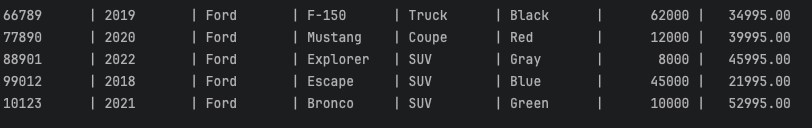

# CarDealership

Console-based dealership application made with `Java`. This app would sit on the desk of a salesman or sale manager at a dealership.

This CLI app allows the users to pick from a list of dealership, view and filter through a dealerships inventory, add vehicles to the existing inventory, and also remove them.
The vehicles each dealership sells will be persisted in a pipe-delimited file, with the format `<dealership_name.csv`. 

---

### File Format:

The `.csv` files that store each dealerships information should follow the following format

```text
Name of Dealership|Address of Dealership|Phone number of Dealership
10112|1993|Ford|Explorer|SUV|Red|525123|995.00
37846|2001|Ford|Ranger|truck|Yellow|172544|1995.00
44901|2012|Honda|Civic|SUV|Gray|103221|6995.00
```

- The first line should contain the information about the dealership itself
  - `Name|Address|Number`
- All the lines going forward should contain the information about each vehicle registered. (1 line per vehicle)
  - `Vin|Year|Make|Model|Type|Color|Mileage|Price`

---

### Screenshots:

**Main Menu**


**Listing all entries in a dealership:**



**Adding a Vehicle**

